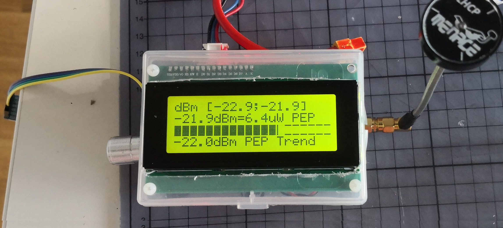
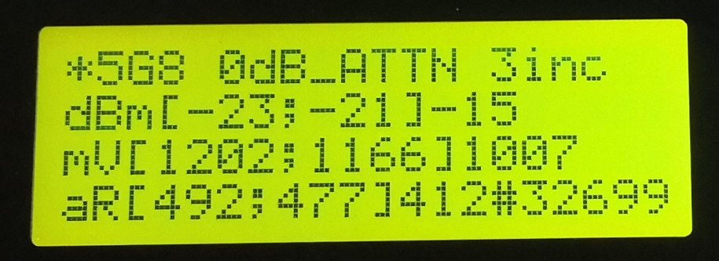

# RFpowerMeter
RF PeakEnvelopePower Meter for AD8317, AD8318 or similar

allows to compare TX antennae against your proven RX antenna; works ok for fpv/analog video gear. Measuring Peak Envelope Power instead of maximum values or some averaging does effectively eliminate noise from surrounding wifi equipment and it is the right thing to do. Traditional receivers' rssi value is not sensitive enough for this.

## features
* update display once per second
* approx 30.000 samples / second
* display
  * minimal and peak envelope power PEP
  * PEP (including external attenuation) in both dBm and mW
  * bar graph of PEP
  * trend of PEP (moving average)
* use rotary encoder to
  * select band and its presets (currently only for 5G8 and 2G4 band)
  * dial in attached (outside of this project) attenuator value
  * tune incremental parameter for bucket computation of PEP
  * toggle BT output on/off

## hardware
* arduino 328p
* detector AD8318
* rotary encoder with button dc11
* display 4*20 text
* optional bluetooth module

## note/warning
there are too many flavours and variants of text displays and arduino IDEs with libraries installed (or not). In effect this code is not working out of the box but you have to adapt to your hardware (display and sensor) and cater for suitable libraries yourself

## licence
my code is under GPL, my preferred choice. It was inspired and over time copy/pasted from too many other projects to remember and eventually this comes as close as I can get to a complete rewrite. The fastAnalogRead() function was borrowed from its owner as mentioned in source.
Thanks go to [Owen Duffy](https://github.com/owenduffy) for his continuing encouragement and guidance whenever I got lost with the RF side of things.
